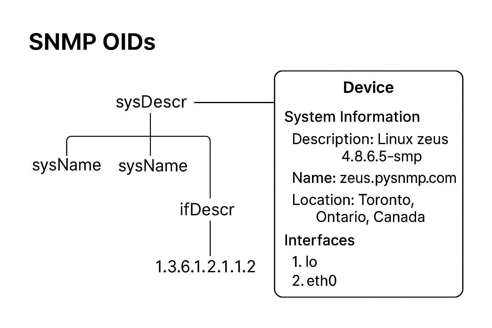

snmp emulator 

### source of `Dockerfile`

https://github.com/alpine-docker/multi-arch-docker-images/blob/master/snmpsimulator/Dockerfile

### Daily CI build logs

N/A

### Docker image tags

https://hub.docker.com/repository/docker/alpine/snmpsimulator/tags

### quick start

```
docker run -d -p 1161:1161/udp alpine/snmpsimulator
```

Now, you can run the test
```
# make sure you have installed snmp cli
# in mac: brew install net-snmp
# in linux: sudo apt install snmp
$ snmpwalk -v2c -c public localhost:1161 1.3.6.1.2.1                                                                                                          [master]
SNMPv2-MIB::sysDescr.0 = STRING: Linux zeus 4.8.6.5-smp #2 SMP Sun Nov 13 14:58:11 CDT 2016 i686
SNMPv2-MIB::sysObjectID.0 = OID: NET-SNMP-MIB::netSnmpAgentOIDs.10
DISMAN-EVENT-MIB::sysUpTimeInstance = Timeticks: (124051389) 14 days, 8:35:13.89
SNMPv2-MIB::sysContact.0 = STRING: LeXtudio Inc., support@lextudio.com
SNMPv2-MIB::sysName.0 = STRING: zeus.pysnmp.com (you can change this!)
SNMPv2-MIB::sysLocation.0 = STRING: Toronto, Ontario, Canada
SNMPv2-MIB::sysServices.0 = INTEGER: 72
SNMPv2-MIB::sysORLastChange.0 = Timeticks: (124051390) 14 days, 8:35:13.90
SNMPv2-MIB::sysORID.1 = OID: SNMP-FRAMEWORK-MIB::snmpFrameworkMIBCompliance
SNMPv2-MIB::sysORID.2 = OID: SNMP-MPD-MIB::snmpMPDCompliance
SNMPv2-MIB::sysORID.3 = OID: SNMP-USER-BASED-SM-MIB::usmMIBCompliance
SNMPv2-MIB::sysORID.4 = OID: SNMPv2-MIB::snmpMIB
SNMPv2-MIB::sysORID.5 = OID: TCP-MIB::tcpMIB
SNMPv2-MIB::sysORID.6 = OID: IP-MIB::ip
SNMPv2-MIB::sysORID.7 = OID: UDP-MIB::udpMIB
SNMPv2-MIB::sysORID.8 = OID: SNMP-VIEW-BASED-ACM-MIB::vacmBasicGroup
SNMPv2-MIB::sysORDescr.1 = STRING: The SNMP Management Architecture MIB.
SNMPv2-MIB::sysORDescr.2 = STRING: The MIB for Message Processing and Dispatching.
SNMPv2-MIB::sysORDescr.3 = STRING: The management information definitions for the SNMP User-based Security Model.
SNMPv2-MIB::sysORDescr.4 = STRING: The MIB module for SNMPv2 entities
SNMPv2-MIB::sysORDescr.5 = STRING: The MIB module for managing TCP implementations
SNMPv2-MIB::sysORDescr.6 = STRING: The MIB module for managing IP and ICMP implementations
SNMPv2-MIB::sysORDescr.7 = STRING: The MIB module for managing UDP implementations
SNMPv2-MIB::sysORDescr.8 = STRING: View-based Access Control Model for SNMP.
SNMPv2-MIB::sysORUpTime.1 = Timeticks: (0) 0:00:00.00
SNMPv2-MIB::sysORUpTime.2 = Timeticks: (0) 0:00:00.00
SNMPv2-MIB::sysORUpTime.3 = Timeticks: (0) 0:00:00.00
SNMPv2-MIB::sysORUpTime.4 = Timeticks: (0) 0:00:00.00
SNMPv2-MIB::sysORUpTime.5 = Timeticks: (0) 0:00:00.00
SNMPv2-MIB::sysORUpTime.6 = Timeticks: (0) 0:00:00.00
SNMPv2-MIB::sysORUpTime.7 = Timeticks: (0) 0:00:00.00
SNMPv2-MIB::sysORUpTime.8 = Timeticks: (0) 0:00:00.00
IF-MIB::ifNumber.0 = INTEGER: 2
IF-MIB::ifIndex.1 = INTEGER: 1
IF-MIB::ifIndex.2 = INTEGER: 2
IF-MIB::ifDescr.1 = STRING: lo
IF-MIB::ifDescr.2 = STRING: eth0
IF-MIB::ifType.1 = INTEGER: softwareLoopback(24)
IF-MIB::ifType.2 = INTEGER: ethernetCsmacd(6)
IF-MIB::ifMtu.1 = INTEGER: 16436
IF-MIB::ifMtu.2 = INTEGER: 1500
IF-MIB::ifSpeed.1 = Gauge32: 10000000
IF-MIB::ifSpeed.2 = Gauge32: 100000000
IF-MIB::ifPhysAddress.1 = STRING:
IF-MIB::ifPhysAddress.2 = STRING: 0:12:79:62:f9:40
IF-MIB::ifAdminStatus.1 = INTEGER: up(1)
IF-MIB::ifAdminStatus.2 = INTEGER: up(1)
IF-MIB::ifOperStatus.1 = INTEGER: up(1)
IF-MIB::ifOperStatus.2 = INTEGER: up(1)
IF-MIB::ifLastChange.1 = Timeticks: (123999999) 14 days, 8:26:39.99
IF-MIB::ifLastChange.2 = Timeticks: (123999999) 14 days, 8:26:39.99
IF-MIB::ifLastChange.2 = No more variables left in this MIB View (It is past the end of the MIB tree)
```

